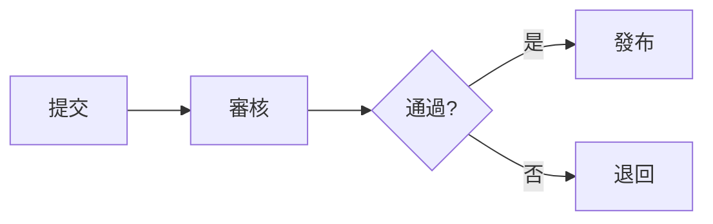

# x-say

整理並呈現資訊，讓讀者一眼看見全貌。先決定要表達的結構，再決定版面與視覺樣式；不為套用固定格式而犧牲清晰度。

純文字圖一律使用等寬字型。中文全形字在終端佔兩格、emoji 寬度不定，因此對齊敏感的框線、欄位用半形字（英文／數字）標籤較安全；用中文時接受近似對齊，或改用 Markdown 表格讓渲染器對齊。

## When to use

- 使用者明確要求整理、展示、畫圖、呈現資訊。
- 主動呈現大量、複雜或結構化的資訊：階層、分類、比較、流程、依賴、時間、分層等。

不要用在：不需要結構的簡短回答、自由對話、單一事實陳述。

## Choose the format by relationship type

先確定結構（要表達什麼），再選格式。選錯格式是最大的可讀性殺手——階層硬塞進表格、流程硬塞進樹狀圖，讀者都要在腦中重建結構。

| 關係 / 結構 | 格式 |
|---|---|
| 階層、巢狀分類、父子（無環） | 樹狀圖 |
| 項目屬性比較、扁平清單、交叉檢視 | 表格 |
| 二維定位（機率×影響、緊急×重要、重要度×成本） | 矩陣 |
| 流程、分支、狀態轉換 | 流程圖 / 狀態圖 |
| 多個參與者之間按時間往來的消息 | 序列圖 |
| 有向的多對多依賴、fan-in/fan-out、循環 | 依賴圖（節點連結） |
| 時間、階段、演進、roadmap | 時間軸 |
| 分層、堆疊、抽象層次（不表任意依賴） | 分層圖 |

## Tree（樹狀圖）

階層、巢狀分類、父子關係（無環）。兩種常見形式：

1. Boxed tree（方框樹）——節點用方框、邊用連線，根節點要連出子節點：

```
     ┌──────┐
     │ Root │
     └──────┘
        │
   ┌────┴────┐
┌──────┐  ┌──────┐
│  A   │  │  B   │
└──────┘  └──────┘
```

2. node-link with labeled edges（帶標籤邊的節點連結圖）：

```
App ──管理──▶ User
  └──擁有──▶ Order
```

組織圖式配置（由上往下、父節點置中、子節點橫向展開）適合較寬的階層：

```
      Root
   ┌───┼───┐
   A   B   C
```

## Table（表格）

項目屬性比較、扁平清單、交叉檢視。用狀態符號做視覺掃描：

| 項目 | 狀態 | 說明 |
|---|---|---|
| 登入流程 | ✅ | 已完成 |
| 付款流程 | ⚠️ | 部分完成，待確認 |
| 匯出功能 | ❌ | 未開始 |

## Matrix（矩陣）

兩個維度同時定位。行列各一軸，格子填文字值（不是符號）。例：機率 × 影響 → 推導風險等級：

| 機率＼影響 | 低 | 中 | 高 |
|---|---|---|---|
| 高 | 中 | 高 | 高 |
| 中 | 低 | 中 | 高 |
| 低 | 低 | 低 | 中 |

## Flow / state（流程圖 / 狀態圖）

流程、分支、狀態轉換。節點 + 箭頭 + 標籤邊：

```
提交 → 審核 → 通過?
              ├─ 是 → 發布
              └─ 否 → 退回
```

狀態圖（節點是狀態、邊是轉換，可標事件）：

```
待審核 ──通過──▶ 已發布
   └──否決──▶ 已退回
```

## Sequence（序列圖）

多個參與者之間按時間往來的消息。兩端箭頭等寬，讓參與者欄位對齊：

```
Client ──請求──▶ Server
Client ◀──回應── Server
```

## Dependency graph（依賴圖）

有向的多對多依賴、fan-in/fan-out、循環。節點 + 有向箭頭，必要時加邊標籤：

```
A ──▶ B
│     │
▼     ▼
C ◀── D
```

樹狀圖只適合無環的父子關係；有循環或一對多/多對多依賴時用此圖，不要把循環壓成假的上下層順序。

## Timeline（時間軸）

時間、階段、演進、roadmap。用內聯標記避免欄位對齊問題：

```
● v1.0 發布   ● v1.1 修補   ● v2.0 重構   ● v2.1 效能
```

## Layers（分層圖）

分層、堆疊、抽象層次（介面／業務／資料）。由上到下每層一個方框，不做任意依賴關係：

```
┌─────────────┐
│     UI      │
├─────────────┤
│    Logic    │
├─────────────┤
│    Data     │
└─────────────┘
```

## Chunking（大內容拆區）

內容多、結構複雜時，先拆成可掃讀的區塊：

1. 開頭用一句話 overview 講清全貌。
2. 每個區塊一個主題、一個標題，順序一致。
3. 區塊之間留白或分隔；不把多種關係擠進同一張圖。

## Legend（圖例）

符號用得多時，在頂部定義一次、之後重複使用，不讓讀者重新推導：

```
圖例：✅ 完成  ⚠️ 部分／待確認  ❌ 未完成
```

同一份輸出裡，每個符號只保留一種意義；要表達不同維度（如風險等級）時改用文字值或另立圖例。

## Headings, symbols, and emoji

- 適度使用標題、分區、符號與 emoji（✅、⚠️、❌）強化辨識與閱讀節奏。
- 符號只輔助掃描，不取代文字承載的意義——意義必須由文字本身傳達。

## Numbering（數字記號）

對比樹/圖表的變化、或讓討論能指到確切位置時，加編號：

```
(1) 登入 ──▶ (2) 首頁
                └──▶ (3) 設定
```

## Mermaid（可選）

流程、序列、狀態、mindmap 太複雜、純文字難以表達時，用 Mermaid（終端會渲染成 ASCII）。簡單關係仍優先純文字：



## Avoid

- 少用過度巢狀、逐節點展開的目錄式樹（exhaustive outline）；省略對讀者當前比較或導航無貢獻的分支與層級。
- 不為套用固定格式而犧牲清晰度。
- 不把多種關係擠進同一張圖；拆開各畫一張更清楚。
